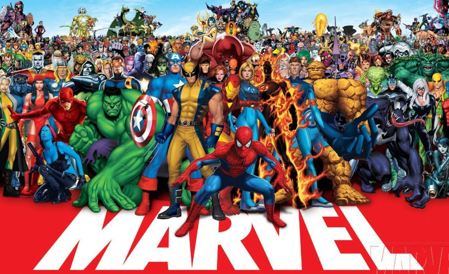

## API de consulta de personagens e revistas em quadrinhos da marvel

Esta API tem como finalidade retornar um JSON personagens e revistas em quadrinhos da [marvel](https://developer.marvel.com/), tambem retornar endpoints de historias em quadrinhos, autores e series da marvel. 

## Instalação

Para rodar o projeto deve ter instalado o Node JS e o NPM e rodar os comandos abaixo:

```bash
  npm install 
  npm run start
```

## Documentação da API

#### Rota de consulta de personagens da marvel

```
  GET /characters
```
*Sem parâmetros
#### Retorna um JSON

```
  Deve retornar um JSON com os dados dos personagens da marvel como no exemplo abaixo.
  {
    "code": 200,
    "status": "Ok",
    "copyright": "© 2022 MARVEL",
    "attributionText": "Data provided by Marvel. © 2022 MARVEL",
    "attributionHTML": "<a href=\"http://marvel.com\">Data provided by Marvel. © 2022 MARVEL</a>",
    "etag": "bdfc0662a771ac61e96e5686e1ed880cce2f55b0",
    "data": {
        "offset": 0,
        "limit": 20,
        "total": 1561,
        "count": 20,
        "results": [
            {
                "id": 1011334,
                "name": "3-D Man",
                "description": "",
                "modified": "2014-04-29T14:18:17-0400",
                "thumbnail": {
                    "path": "http://i.annihil.us/u/prod/marvel/i/mg/c/e0/535fecbbb9784",
                    "extension": "jpg"
                },
                "resourceURI": "http://gateway.marvel.com/v1/public/characters/1011334",
                "comics": {
                    "available": 12,
                    "collectionURI": "http://gateway.marvel.com/v1/public/characters/1011334/comics",
                    "items": [
                        {
                            "resourceURI": "http://gateway.marvel.com/v1/public/comics/21366",
                            "name": "Avengers: The Initiative (2007) #14"
                        },
                        {
                            "resourceURI": "http://gateway.marvel.com/v1/public/comics/24571",
                            "name": "Avengers: The Initiative (2007) #14 (SPOTLIGHT VARIANT)"
                        },
                        {
                            "resourceURI": "http://gateway.marvel.com/v1/public/comics/21546",
                            "name": "Avengers: The Initiative (2007) #15"
                        },
                        {
                            "resourceURI": "http://gateway.marvel.com/v1/public/comics/21741",
                            "name": "Avengers: The Initiative (2007) #16"
                        },
                        {
                            "resourceURI": "http://gateway.marvel.com/v1/public/comics/21975",
                            "name": "Avengers: The Initiative (2007) #17"
                        },
                        {
                            "resourceURI": "http://gateway.marvel.com/v1/public/comics/22299",
                            "name": "Avengers: The Initiative (2007) #18"
                        },
                        {
                            "resourceURI": "http://gateway.marvel.com/v1/public/comics/22300",
                            "name": "Avengers: The Initiative (2007) #18 (ZOMBIE VARIANT)"
                        },
                        {
                            "resourceURI": "http://gateway.marvel.com/v1/public/comics/22506",
                            "name": "Avengers: The Initiative (2007) #19"
                        },
                        {
                            "resourceURI": "http://gateway.marvel.com/v1/public/comics/8500",
                            "name": "Deadpool (1997) #44"
                        },
                        {
                            "resourceURI": "http://gateway.marvel.com/v1/public/comics/10223",
                            "name": "Marvel Premiere (1972) #35"
                        },
                        {
                            "resourceURI": "http://gateway.marvel.com/v1/public/comics/10224",
                            "name": "Marvel Premiere (1972) #36"
                        },
                        {
                            "resourceURI": "http://gateway.marvel.com/v1/public/comics/10225",
                            "name": "Marvel Premiere (1972) #37"
                        }
                    ],
                    "returned": 12
                },
                ......
````

## Tecnologias utilizada

**Back-end:** Node, Express, Axios

## 🚀 Sobre mim
Eu sou uma pessoa desenvolvedora full-stack, usando as tecnologias Node JS no Back-end e React no Fron-end, API Restfull e estudando outras tecnologias interessantes e em alta no mercado.

## 🛠 Habilidades
Javascript, HTML, CSS, Node JS, PHP, Mongo DB, React...

## 🔗 Links
[](https://github.com/Diones25)
[](https://www.linkedin.com/in/diones-pereira-alves-31bb3969/)